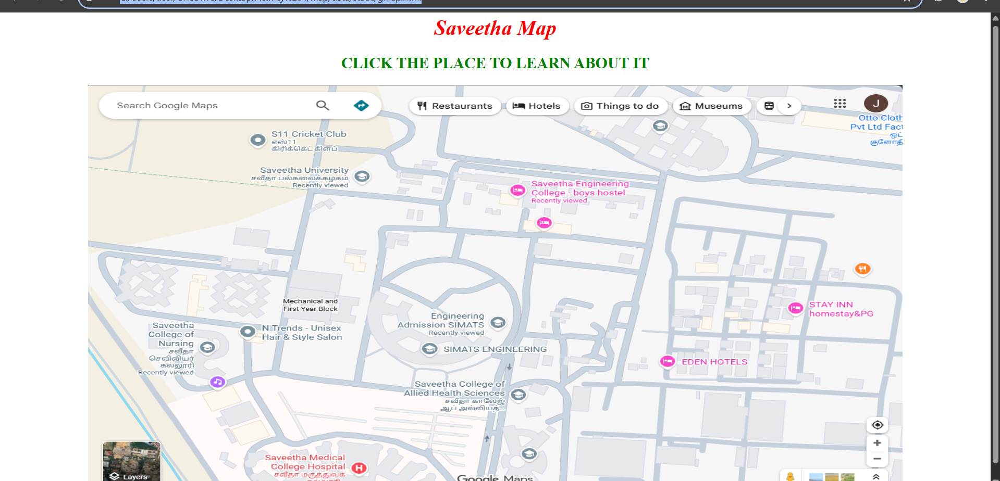

# Ex04 Places Around Me
# Date:
# AIM
To develop a website to display details about the places around my house.

# DESIGN STEPS
## STEP 1
Create a Django admin interface.

## STEP 2
Download your city map from Google.

## STEP 3
Using <map> tag name the map.

## STEP 4
Create clickable regions in the image using <area> tag.

## STEP 5
Write HTML programs for all the regions identified.

## STEP 6
Execute the programs and publish them.

# CODE
gmap.html
<html>
    <head>
        <title style="color:red">
            south india map 
        </title>
    </head>
    <body>
        <h1 align="center">
            <i>Saveetha Map</i>
        </h1>
        <h2 align="center">
            <b>CLICK THE PLACE TO LEARN ABOUT IT</b>
        </h2>
        

        
        <map name="mapu pa">
            <area shape="rect" coords="832,150,1075,119" href="saveetha.html" alt="">
            <area shape="rect" coords="710,423,637,638" href="simats.html" alt="">
            <area shape="rect" coords="132,496,268,654" href="savnur.html" alt="">
            <area shape="rect" coords="627,770,837,734" href="sahe.html" alt="">
        </map>
        

    </body>
</html>

sahe.html
<html>
    <head>'
        <title>Microsoft</title>
    </head>
    <body align="center" bgcolor="grey">
        <h1 align="centre">
        <b>SAVEETHA COLLEGE OF ALLIED HEALTH SCIENCES</b>
        </h1>
        <h3 align="center">
         THANDALAM
        </h3>
        

        
        

        

        
            Saveetha College of Allied Health and Science in Chennai offers top-tier programs in fields like Medical Lab Technology, 
            Radiology, and Operation Theatre Technology. Backed by a 2000-bed hospital, students receive hands-on clinical training 
            and access to modern labs. Accredited with NAAC A++, it blends academic rigor with real-world healthcare experience.
        

    </body>
</html>

saveetha.html
<html>
    <head>'
        <title>Microsoft</title>
    </head>
    <body align="center" bgcolor="pink">
        <h1 align="centre">
        <b>SAVEETHA ENGINEERING COLLEGE</b>
        </h1>
        <h3 align="center">
         THANDALAM
        </h3>
        

        
        

        

        
            Saveetha Engineering College, located in Chennai, Tamil Nadu, is a premier institution known for its commitment to academic excellence  and innovation
            in engineering education. Established in 2001, the college is part of the Saveetha Group of Institutions and is affiliated with Anna University. 
            It offers a wide range of undergraduate and postgraduate programs in engineering and technology, supported by state-of-the-art laboratories, 
            modern infrastructure, and a vibrant campus life. With a strong emphasis on research, industry collaboration, and holistic development,
            Saveetha Engineering College nurtures students to become skilled professionals and responsible global citizens.

        

    </body>
</html>
saveethamed.html
<html>
    <head>'
        <title>Microsoft</title>
    </head>
    <body align="center" bgcolor="violet">
        <h1 align="centre">
        <b>SAVEETHA MEDICAL COLLEGE HOSPITAL</b>
        </h1>
        <h3 align="center">
         THANDALAM
        </h3>
        

        
        

        

        
            Saveetha Medical College and Hospital (SMCH) in Chennai is a top-ranked,
            NAAC A++ accredited institution offering MBBS, MD/MS, DM/MCh, and Ph.D programs.
            Its 2000-bed super-specialty hospital provides advanced clinical training and
            healthcare services. Known for cutting-edge infrastructure, high patient volume, 
            and research-driven education, SMCH blends academic excellence with real-world medical experience.

        

    </body>
</html>
savnur.html
<html>
    <head>'
        <title>Microsoft</title>
    </head>
    <body align="center" bgcolor="sky blue">
        <h1 align="centre">
        <b>SAVEETHA COLLEGE OF NURSING</b>
        </h1>
        <h3 align="center">
         THANDALAM
        </h3>
        

        
        

        

        
            Saveetha College of Nursing in Chennai is a top-ranked institution offering B.Sc, M.Sc, Post Basic B.Sc, and Ph.D programs in nursing. 
            It provides hands-on clinical training at its own 1200-bed hospital, modern campus facilities, and international learning opportunities.
            Accredited with NAAC A++ and approved by the Indian Nursing Council, it combines academic excellence with practical experience for a global nursing career.
        

    </body>
</html>
simats.html
<html>
    <head>'
        <title>Microsoft</title>
    </head>
    <body align="center" bgcolor="purple">
        <h1 align="centre">
        <b>SIMATS ENGINEERING</b>
        </h1>
        <h3 align="center">
         THANDALAM
        </h3>
        

        
        

        

        
            SIMATS Engineering, part of Saveetha Institute in Chennai, is a top-ranked, NAAC A++ accredited institution offering cutting-edge
            programs in AI, Data Science, Mechanical, and more. It’s globally recognized for sustainability, ranks 45th in India (NIRF 2025),
            and provides hands-on learning, modern labs, and strong placements with top companies like TCS and Infosys.
        

    </body>
</html>

</html>
# OUTPUT

# RESULT
The program for implementing image maps using HTML is executed successfully.
